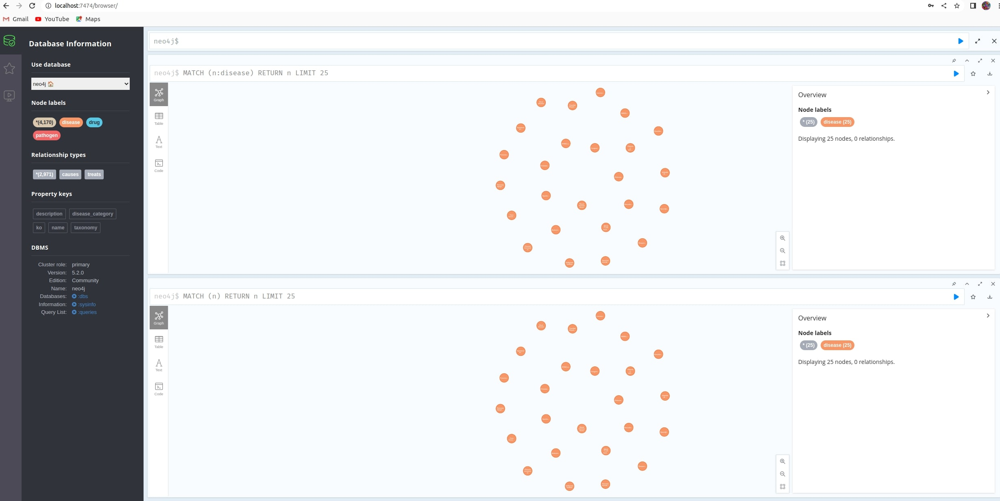

# NEO4J For Disease Analytics

git clone https://github.com/MATRIX4284/neo4j_disease_analytics

## Extracting The Data

Navigate to data/kegg_diseases and follow the instructions given.

## Starting the NEO4J Docker and NEODASH Docker.

```console
cd ../..
./run_neo4j_app.sh
```
## Check if neo4j is running by going to NEO4J browser service:

http://localhost:7474/browser/




## Check if NEODASH UI is running by going to NEO4J UI SERVICE:

http://localhost:5005/

## Import data into NEO4J  graph database

### Create the conda environment:


```console
conda create -n neo4j python=3.8
```

### Activate the neo4j conda environment:

```console
conda activate neo4j
```

### Install the Required Packages:

```console
pip3 install -r requirements.txt
```

### Run python script to load the csv files into NEO4J graph database:

```console
python3 load_csv_neo4j.py
```

## Importing DashBoard Into NEODASH UI

## LOUVAIN ALGORITHM IN NEO4J BROWSER

## PAGERANK ALGORITHM IN NEO4J 

